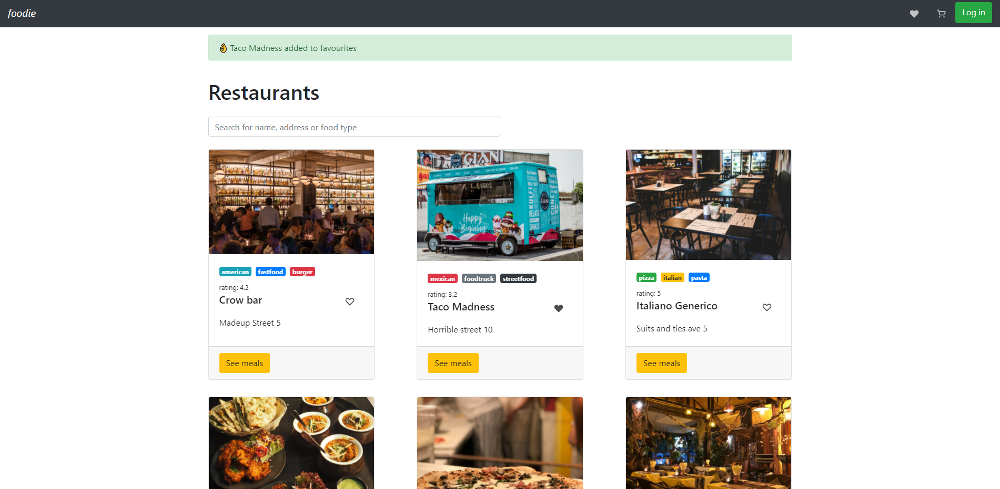
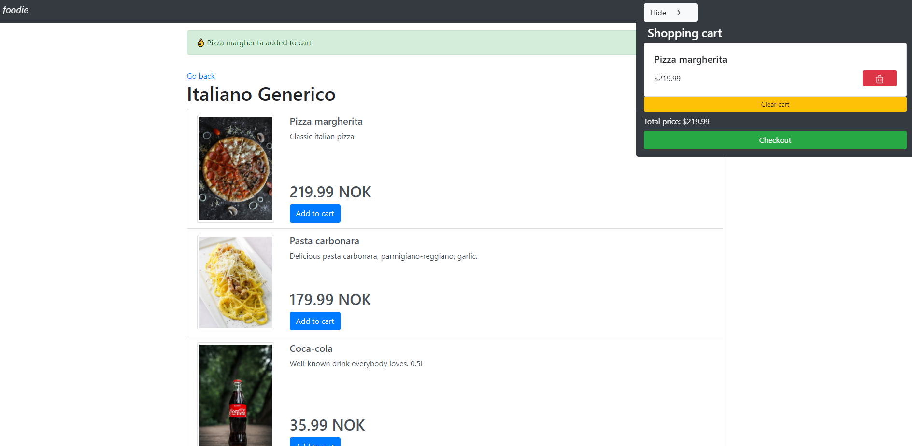

# Foodie

a Restaurant search app built in plain JavaScript
This was an assignment for Noroff's Front-end 2nd Year course.
We weren't allowed to use any external frameworks or libraries for the front-end so I made my own reactive view library inspired by hyperapp.

## [LIVE DEMO](http://bartektelec.github.io/foodie-app/index.html) - backend is stored on heroku, may take a while for server to start when app is launched first time

## Features

- Bootstrap based UI
- Strapi as a back-end
- the Reactive "state" uses the Observer pattern to notify all the bound elements when it's changed
- Reactive Search bar, search for restaurant names as well as food types
- Add restaurants to favourites
- View the menu and add meals to cart
- Cart shows all added items and sums up the total price
- Favourite restaurants and shopping cart are stored in LocalStorage
- Authorization wasn't a goal in this assignment so I didn't focus on that

## Credits

- [Bootstrap v4.5](https://getbootstrap.com/)
- [Pexels](https://www.pexels.com/nb-no/)
- [Eva-Icons](https://akveo.github.io/eva-icons/#/)
- [Strapi](https://strapi.io/)
